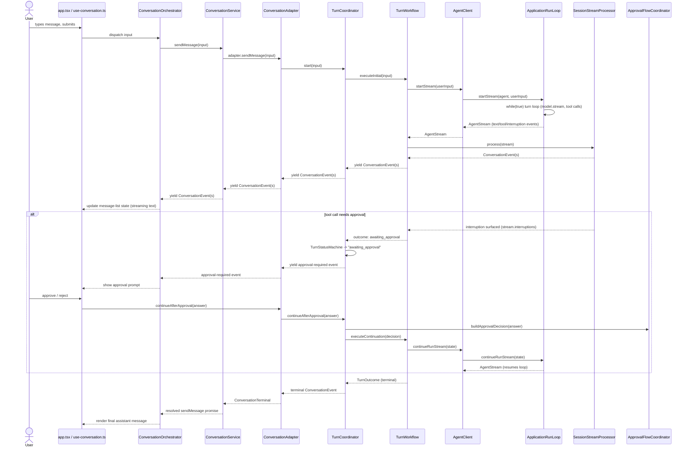
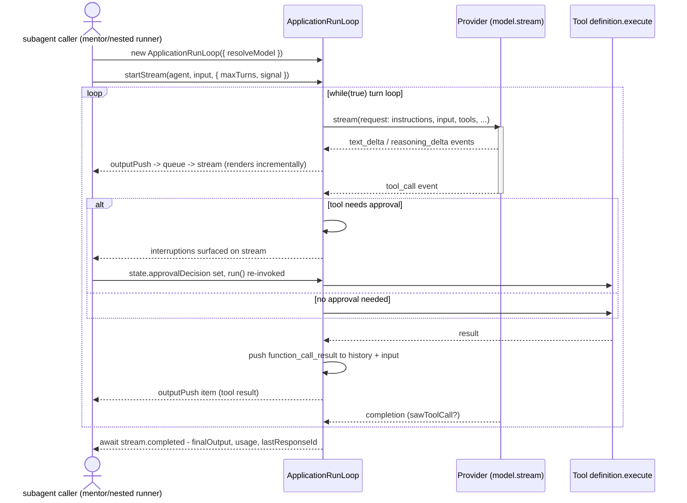

# Architecture Overview

Terminal AI assistant: React (Ink) UI + an application-owned agent runtime + TypeScript/Node.
Chats with an agent that can run shell commands / edit files, gated by approval prompts.

The `@openai/agents` SDK has been fully removed — nothing under `source/` imports it.
The run loop is ours (`services/agent-runtime/application-run-loop.ts`); the plain
`openai` package remains only as one provider transport among several.

## Entry points

```
cli.tsx  ───assembles the app
  ├── app.tsx            interactive Ink UI
  └── non-interactive.ts same conversation system, no UI
```

## Turn lifecycle (user message → rendered response)

> Verified against source on 2026-08-02.

The main path crosses six layers before reaching the engine. That is deliberate;
each one below names the concept it owns, so a reader can tell whether a change
belongs to it. The one layer that hides no decisions is `ConversationService` —
it exists as a published API boundary, not as a step in the algorithm.

```
app.tsx (user types)
  │
  ▼
use-conversation.ts
  │  owns a ConversationOrchestrator instance   [services/conversation/conversation-orchestrator.ts]
  │  (turns ConversationEvents into UI message-list state: streaming, approvals, etc.)
  ▼
ConversationService.sendMessage()   [services/conversation/conversation-service.ts]
  │  public facade — holds a ConversationAdapter built by
  │  createConversationRuntime() [conversation-runtime-factory.ts]
  │  which calls createSessionRuntime() [services/session/session-composition.ts]
  │  — the actual composition root for turn/session internals
  ▼
ConversationAdapter [services/conversation/conversation-adapter.ts]
  │  sets up logging/traffic context, routes via QueueController
  │  [services/queue/queue-controller.ts] (turn admission)
  ▼
TurnCoordinator.start()   [services/session/turn-coordinator.ts]
  │  guards admission (TurnStatusMachine), checks stale/aborted approvals
  │  (ApprovalFlowCoordinator [services/approval/approval-flow-coordinator.ts])
  ▼
TurnWorkflow.executeInitial()   [services/session/turn-workflow.ts]
  │  preps input (InitialInputPreparer, SessionInputPlanner — both in services/session/)
  │  drives agent client → provider registry → streams response
  │  feeds events to SessionStreamProcessor [services/session/session-stream-processor.ts]
  ▼
Tool call requested?
  │
  ├─ yes → ApprovalFlowCoordinator validates → TurnStatusMachine → "awaiting_approval"
  │           user approves/rejects
  │           ConversationAdapter → TurnCoordinator.continueAfterApproval()
  │           → TurnWorkflow.executeContinuation()
  │           → response | approval_required | fresh_start_required | stale
  │
  └─ no  → ConversationAdapter collects terminal result → ConversationOrchestrator
             → renders in message list
```

Errors are classified/recovered by `services/retry/`. `fresh_start_required` makes
`TurnWorkflow` re-drive initial execution from history.

### What each layer owns

| Layer | Owns | Why it isn't collapsible |
| --- | --- | --- |
| `ConversationOrchestrator` | event stream → UI message-list projection | UI needs a different shape (grouped, mutable, streaming-aware) than the event log. Internals: [conversation-orchestrator-internals.md](conversation-orchestrator-internals.md) |
| `ConversationService` | **published API surface only** | ~35 methods, nearly all one-line delegations to `#runtime.state` / `#runtime.settings` / `#adapter`. Keeps runtime internals out of components; 44 non-test call sites bind to it. Hides no decisions — treat added policy here as a smell |
| `ConversationAdapter` | queue admission, request-id dedup, traffic-mode context, queued-turn promise settlement | real bookkeeping across concurrent submissions |
| `TurnCoordinator` | the **lease / staleness protocol** | drives the workflow generator by hand so it can re-check `statusMachine.owns(lease)` after every yield and `return({kind:'stale'})` to cancel mid-flight. Small file, non-obvious invariant |
| `TurnWorkflow` | input prep, recovery, continuation drive | the largest file on the path (~1090 lines) — most new turn behavior lands here. Internals: [turn-workflow-internals.md](turn-workflow-internals.md) |
| `SessionStreamProcessor` | provider stream → `ConversationEvent` normalization | single place providers stop leaking their shapes |



`services/agent-runtime/` (`ApplicationRunLoop`) is the shared engine that actually
streams the model and dispatches tool calls — both pipelines below drive it, just
through different wrapper classes:

There are **five construction sites** for `ApplicationRunLoop`, in three groups:

- **Main conversation path** (diagram above): `TurnWorkflow` drives it via `AgentClient`
  (`source/lib/agent-client.ts:159`), which wraps `ApplicationRunLoop.startStream` /
  `continueRunStream`. `AgentClient` also owns the only `AgentChatService`
  (`source/lib/agent-chat-service.ts`) instance — that class serves *this* path, not
  subagents. Approval pauses/resumes go through `TurnCoordinator` +
  `ApprovalFlowCoordinator` + `TurnStatusMachine`.
- **Subagent path** (parallel, not driven by `TurnCoordinator`/`TurnWorkflow`): mentor and
  nested runners (`services/subagents/mentor-runner.ts:167`, `nested-runner.ts:313`) each
  construct `new ApplicationRunLoop({ resolveModel })` **directly** and call `startStream`.
  They do not go through `AgentClient` or `AgentChatService`.
- **Odd one out:** `source/tools/file/edit-healing.ts:193` builds its own loop too — a
  *tool* re-entering the engine. It works, but it's a third entry point the two-pipeline
  story doesn't account for; know it exists before assuming the engine has two callers.



## Directory map

```
source/
├── cli.tsx, app.tsx, non-interactive.ts   entry points
├── agent.ts                 defines the agent, registers tools (new tools go here)
├── prompts/                 system prompt assembly (product behavior, not docs!)
│   ├── prompt-constructor.ts   base profile + conditional fragments
│   ├── prompt-profiles.ts      maps models → base prompt
│   ├── fragments/, subagents/
├── providers/                ~11 provider transports (register new ones via registry)
│   ├── registry.ts
│   ├── codex-responses-model.ts  largest file in the repo (~1465 lines)
│   ├── openai-*, ai-sdk-*, codex*, openrouter*, opencode*, llama-cpp*
│   ├── common/, fetch/, web-search/
├── services/
│   ├── conversation/          conversation-service.ts (facade), conversation-orchestrator.ts
│   │                           (UI-side event→message-list layer), conversation-adapter.ts,
│   │                           conversation-store.ts, replay/persistence/decoder helpers
│   ├── session/                turn/session internals (moved out of conversation/ in a
│   │                           recent refactor): session-composition.ts (composition root),
│   │                           turn-coordinator.ts, turn-workflow.ts, session-stream-processor.ts,
│   │                           turn-status-machine.ts, input planners, continuation handlers
│   ├── agent-runtime/          THE SHARED ENGINE — not a subagent-only path.
│   │                           application-run-loop.ts (model streaming + tool dispatch,
│   │                           driven by every path above), plus agent/model/tool/skill
│   │                           resolution, execution-budget.ts, scope-resolver.ts (security)
│   ├── subagents/              subagent-manager.ts = dispatcher + async run registry
│   │                             (status, cancellation, lifecycle); run logic lives in
│   │                             mentor-runner / execution-runner / nested-runner
│   ├── approval/               approval decision policy
│   ├── retry/                  retry classification & recovery
│   ├── queue/                  turn admission (QueueController)
│   ├── settings/, memory/, skills/, logging/
├── tools/                    agent-callable tools (file, system, web, memory, languages, agent)
├── components/                Ink UI components
├── hooks/                     e.g. use-conversation.ts
├── contracts/, types/, lib/, utils/
```

## Key ownership rules (from `architecture` skill)

| Concern | Owner |
| --- | --- |
| Approval decisions | `services/approval/` |
| Retry/recovery policy | `services/retry/` |
| Provider transport | `providers/` or `lib/` |
| Role/prompt/env/tool-guidance | `services/subagents/role-loader.ts` |
| Capability & write/shell safety policy | `services/subagents/tool-policy.ts` |
| Subagent wiring, nested role-tool cache | `services/subagents/runtime.ts` |
| Session composition | `services/session/session-composition.ts` (single composition root) |
| Model streaming & tool dispatch | `services/agent-runtime/application-run-loop.ts` |

Don't add a new Runner/Driver/Coordinator/Manager just to shorten a file — only when
it owns a stable concept or hides real decisions ("deletion test").

New providers → must go through `providers/registry.ts`.
New tools → must be registered in `agent.ts`.

## Testing

- Regular tests: `pnpm test`
- Provider black-box suite (streaming/tool-call/history/reasoning/error-path regressions
  for provider, bridge, run-loop, registry, non-interactive changes):
  `pnpm test:provider-black-box` — builds `dist/`, runs isolated child-process CLI tests.
  See `scripts/provider-black-box/` and `docs/plans/integration-test-improvement.md`.

## For deeper dives

- [`turn-workflow-internals.md`](turn-workflow-internals.md) — the two-outcome-type /
  trampoline design, `LiveRun` post-execute gates, call-id resolution.
- [`conversation-orchestrator-internals.md`](conversation-orchestrator-internals.md) — the
  five-phase turn shape, queue-vs-orchestrator turn ownership, background notification delivery.
- `architecture` skill (this repo's `.claude/skills/architecture/`) — module-design judgement,
  full runtime-path reference.
- `testing` skill — test scope/standards.
