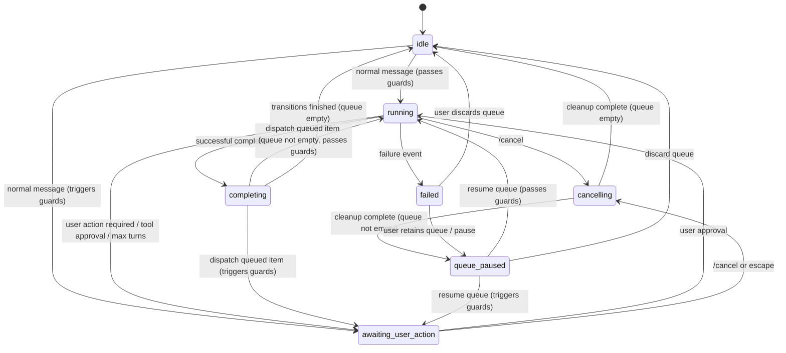

# Term2 Behavior Contract & Execution Specification

This document defines the formal behavior contract and execution rules for the Term2 state and queue management.

---

## 1. Core States & Relation to TurnStatusMachine

Term2 operates a dual-layer state model: a **Conversation/Queue Layer** state machine, and the low-level **TurnStatusMachine** (which owns individual turn execution phases: `idle`, `streaming`, `awaiting_approval`, `continuing`).

The high-level Conversation states map to and coexist with the low-level status machine as follows:

| Core State | Description | Coexisting `TurnStatusMachine` state |
| :--- | :--- | :--- |
| `idle` | No task is active, and the queue is empty. Ready to accept a new message. | `idle` |
| `running` | A top-level run is currently executing. Incoming messages are queued. | `streaming` or `continuing` |
| `cancelling` | The active run is aborting. Cleanup/shutdown hooks are resolving. | `idle` (aborted) |
| `completing` | The active run finished. Transitioning to next queued item or `idle`. | `idle` |
| `queue_paused` | Queue is paused (e.g., after run failure/manual pause). Items accumulate but do not start. | `idle` |
| `awaiting_user_action` | Run is suspended waiting for user interaction (approval, ask_user question, or surge/uncached warnings). | `awaiting_approval` |
| `failed` | Active run failed. The queue is paused, waiting for resume/discard. | `idle` |

---

## 2. Input Categories

Term2 classifies incoming user and system actions into distinct input categories:

1. **Normal Message**: A natural-language prompt or request intended to be run by the agent (e.g., `"explain this code"`).
2. **Slash Command `/cancel`**: Explicit command to abort the currently active top-level run.
3. **Queue Controls**: Actions like `resume queue` or `discard queue`.
4. **Configuration Change (Model)**: Changing the model selected for execution.
5. **Configuration Change (Theme)**: Changing cosmetic elements of the terminal/UI.
6. **Task Completion Event**: Successful completion event returned from the run lifecycle.
7. **Task Failure Event**: Failure or error event returned from the run lifecycle.
8. **User Action Required Event**: A tool request, confirmation, input-surge warning, or large-uncached warning requiring user approval.

---

## 3. State Transition Matrix

The table below defines allowed state transitions. Any transition not listed here must be rejected or raise an error.

---

## 4. Decision Table

| Current State | Input Action | Immediate Action | Deferred/Later Action | Next State |
| :--- | :--- | :--- | :--- | :--- |
| **`idle`** | Sends normal message | Evaluate input guards. If clear, start run; if blocked, prompt user. | Stream agent output | **`running`** or **`awaiting_user_action`** |
| **`running`** | Sends normal message | Add message to pending queue | None | **`running`** |
| **`running`** | Sends `/cancel` | Stop active execution signal via `TurnCoordinator.abort()` | Clean up resources, cancel subagents | **`cancelling`** |
| **`cancelling`** | Sends `/cancel` | Show cancellation in progress message | None | **`cancelling`** |
| **`running`** | Changes model | Record new model selection in settings | Apply configuration snapshot when next queued item starts | **`running`** |
| **`running`** | Changes theme | Apply UI theme changes immediately | None | **`running`** |
| **`running`** | Task completes successfully | Start cleanup | If queue is non-empty, start next run; else idle | **`completing`** |
| **`running`** | Task fails | Stop run, log error | Pause queue execution | **`failed`** |
| **`running`** | User action required | Suspend active execution stream | Prompt user for input (tool approval / ask_user) | **`awaiting_user_action`** |
| **`awaiting_user_action`** | User provides approval | Resume execution or proceed with queued item | Stream next step | **`running`** |
| **`failed`** | Selects resume queue | Unpause queue | Dispatch next queued item (running guards) | **`running`** or **`awaiting_user_action`** |
| **`failed`** | Selects discard queue | Clear queue | Reset system status | **`idle`** |

---

## 5. Timing, Ordering, & Semantics

### Queue Ordering & Guard Evaluation
* The queue operates strictly as **First-In, First-Out (FIFO)**.
* Queued items can be edited or removed safely *only* while they are not executing.
* **Guard Execution Time**: Input guards (input surge guard, large uncached input warning) are evaluated **at execution time** rather than submission time. If a queued item triggers a warning when starting, the queue pauses and the system transitions to `awaiting_user_action`.
* If the queue reaches its maximum capacity, any new normal message is rejected with a clear UI warning without clearing the user's input buffer.

### Settings Timing & Snapshotting
* **Cosmetic Settings (Theme, Font, etc.)**: Applied immediately to the active view.
* **Execution Settings (Model, Temperature, System Instructions)**: Snapshot is taken and frozen when a queue item transitions from queued to execution (`running`). Settings changes made during a run do not mutate the active run, but are saved as the pending configuration for future queued tasks.

### Cancellation Semantics
* A cancel request triggers an abort signal sent to the active provider call and stops all tool execution.
* Subagent runs are recursively cancelled during cleanup.
* Late events arriving from child processes or subagents after cancellation is in progress are ignored and discarded.

### Persistence Semantics
* If Term2 exits or crashes, the queue contents and their snapshots are persisted to local storage under the current session's path.
* Upon restarting Term2, the queue is loaded in a **paused** state. Paid work does not auto-resume without explicit user confirmation.

---

## 6. Explicit Non-Goals (Negative Rules)

* **No Concurrent Runs**: Only one top-level run can execute at any time.
* **No Runtime Mutation**: A normal message cannot alter the parameters (e.g. model) of an already-running model call.
* **No Direct Child Input**: User input cannot be routed directly to subagents.
* **No Silent Settings Mutation**: Settings changes cannot modify the execution parameters of an active run.
* **No Auto-Resume on Failure**: Queued messages will never resume automatically after a failure; they require manual user action.
* **No Natural-Language Cancellation**: Words like "stop" or "cancel" sent as messages are treated as normal conversational inputs, not system commands. Only `/cancel` triggers cancellation.
* **No Message Double-Dipping**: A queued message cannot be simultaneously injected into the active run and executed as a separate future turn.
* **No CLI Logs in Transcript**: Commands typed in the terminal are not inserted as user conversational messages.

---

## 7. Acceptance Tests for Race Conditions

### Test 1: Simultaneous Submission at Completion
* **Given** a run is in the `completing` state,
* **When** the user submits a message at the exact same moment,
* **Then** the message is added to the queue or starts the next run, but never both.

### Test 2: Model Configuration Snapshotted
* **Given** a run is active with Model A,
* **When** the user changes the model setting to Model B,
* **Then** the active run continues using Model A, and newly queued items use Model B.

### Test 3: Failure Isolation
* **Given** there are two queued messages,
* **When** the active run fails,
* **Then** the state transitions to `failed` and neither queued message starts automatically.

### Test 4: Late Child Event during Cancellation
* **Given** cancellation is in progress,
* **When** a late child completion or tool output event arrives,
* **Then** the event is ignored, and no queued task starts until cleanup completes.
