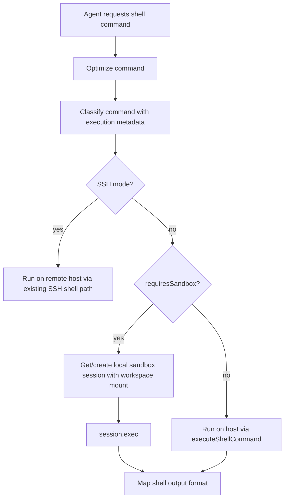

# Refined Implementation Plan: Script Sandboxing

This plan adds optional sandbox routing for agent-generated script execution. The sandbox is intended for environment isolation and process lifecycle containment for accidental/unsafe inline scripts. It is not a hard security boundary and must not be described as preventing a malicious local process from accessing all host resources.

---

## 1. Goal and Scope

* **Goal**: Run inline scripts and local script files in a lifecycle-managed `UnixLocalSandboxSession` with a sanitized process environment, bounded working directory, and reliable child-process cleanup.
* **Threat model**: Protect against accidental agent-generated script behavior, host environment leakage, and orphaned processes. Do not claim protection against malicious host filesystem access; `UnixLocalSandboxSession` is local process isolation, not a VM/container security boundary.
* **In Scope**:
  - Inline/eval execution: `node -e`, `node --eval`, `node -p`, `python -c`, `bash -c`, `sh -c`, `zsh -c`, `dash -c`.
  - Direct local script execution: `./run.sh`, `node temp.js`, `python test.py`, and equivalent relative workspace paths.
  - Mounting the current workspace into the sandbox session so scripts created by file/edit tools are visible to sandboxed commands.
  - A new setting to auto-allow sandboxed commands, defaulting to disabled.
* **Out of Scope**:
  - Treating the sandbox as a security boundary against malicious code.
  - SSH sandboxing. In SSH mode, sandbox routing is disabled and existing remote shell behavior remains unchanged.
  - Changing behavior for ordinary non-script commands such as `git status` or `ls`.

---

## 2. Chosen Approach

Add structured script-detection metadata to the command-safety classifier. The shell tool will classify the optimized command once, decide whether the command should run in the local sandbox, and then execute either through the existing host path or through a cached `UnixLocalSandboxSession` created by `UnixLocalSandboxClient`.



Approval behavior is separate from routing. A sandbox-recommended command remains YELLOW and requires approval unless `shell.autoAllowSandboxedCommands` is `true`.

---

## 3. Files and Components to Change

### A. Classifier and Safety Rules

* **[MODIFY] `source/utils/command-safety/handlers/types.ts`**:
  - Extend `CommandHandlerResult` with optional structured metadata:

```typescript
export interface CommandExecutionMetadata {
  requiresSandbox?: boolean;
  sandboxReason?: string;
}

export interface CommandHandlerResult {
  status: SafetyStatus;
  reasons: string[];
  execution?: CommandExecutionMetadata;
}
```

* **[MODIFY] `source/utils/command-safety/index.ts`**:
  - Extend `ClassifyCommandResult` with `execution: CommandExecutionMetadata`.
  - Merge handler metadata while traversing the AST. If any command node sets `requiresSandbox`, the overall result sets `requiresSandbox: true`.
  - Keep `validateCommandSafety()` backward-compatible by returning `true` for YELLOW/RED only.
  - Do not route based on reason-string matching.

* **[NEW] `source/utils/command-safety/handlers/script-handler.ts`**:
  - Register for `node`, `nodejs`, `python`, `python3`, `bash`, `sh`, `zsh`, and `dash`.
  - Detect eval flags:
    - `node`/`nodejs`: `-e`, `--eval`, `-p`, `--print`.
    - `python`/`python3`: `-c`.
    - shells: `-c`.
  - Detect direct script targets for relative paths and workspace-local names with script extensions:
    - `node temp.js`, `python test.py`, `./run.sh`, `scripts/build.sh`.
  - Return `SafetyStatus.YELLOW`, a human-readable reason, and `execution: { requiresSandbox: true, sandboxReason: '...' }`.
  - Preserve RED behavior for blocked nested commands discovered elsewhere by the main traversal.

* **[MODIFY] `source/utils/command-safety/handlers/index.ts`**:
  - Register the script handler for the interpreters above.

### B. Sandbox Session Lifecycle

* **[MODIFY] `source/services/execution-context.ts`**:
  - Add a typed local sandbox cache. Use SDK types from `@openai/agents/sandbox/local`.
  - Create sessions through `UnixLocalSandboxClient.create()`, not by directly constructing `UnixLocalSandboxSession`.
  - Mount the current workspace path into the sandbox manifest so file-tool outputs in the project are visible to sandboxed commands.
  - Disable sandbox creation when `isRemote()` is true.

```typescript
import type { UnixLocalSandboxSession } from '@openai/agents/sandbox/local';

class ExecutionContext {
  private sandboxSession: UnixLocalSandboxSession | null = null;
  private sandboxClosing: Promise<void> | null = null;

  isSandboxAvailable(): boolean; // false in SSH mode
  getOrCreateSandboxSession(): Promise<UnixLocalSandboxSession>;
  closeSandboxSession(): Promise<void>; // idempotent, awaits active close
}
```

* **Workspace Mounting Decision**:
  - Mount `process.cwd()`/`getCwd()` as the sandbox workspace root.
  - Use SDK manifest/path grants to expose the current workspace read/write as needed for command parity with existing shell behavior.
  - Keep environment sanitized; do not pass `process.env` wholesale into the sandbox manifest.
  - If manifest mounting cannot represent the desired local directory semantics, introduce a small `sandbox-service.ts` wrapper to centralize SDK-specific manifest construction and keep `ExecutionContext` minimal.

* **[MODIFY] `source/cli.tsx`**:
  - Add sandbox cleanup to async shutdown paths before `process.exit()` for `SIGINT`, `SIGTERM`, and non-interactive completion.
  - Keep `process.on('exit')` as best-effort only; do not rely on it for async cleanup.
  - Ensure cleanup is idempotent and does not race SSH disconnect or log writer close.

### C. Shell Tool Routing and Approval

* **[MODIFY] `source/tools/shell.ts`**:
  - Replace the execute-time safety check with `classifyCommandDetailed(optimizedCommand, loggingService)` so routing and plan-mode checks use the same classification result.
  - If `settingsService.get<boolean>('app.planMode')` and classification is YELLOW/RED, keep returning the current read-only error.
  - If `execution.requiresSandbox` and `executionContext?.isSandboxAvailable()` is true, run through `session.exec({ cmd: optimizedCommand, workdir: '.', ... })`.
  - If `execution.requiresSandbox` and SSH mode is active, log/debug that sandbox routing is disabled and run through the existing SSH path.
  - Do not apply RTK wrapping to sandboxed commands.
  - Preserve current status-line output contract: `exit <code>` or `timeout`, followed by trimmed stdout/stderr.
  - Map `SandboxExecResult.stdout`, `stderr`, and `exitCode` into the existing `ShellCommandResult` shape.
  - Implement timeout/abort behavior explicitly. If the SDK cannot enforce `timeout_ms`, wrap `session.exec()` in an abortable timeout and call `closeSandboxSession()` or terminate the active sandbox process on timeout.

* **[MODIFY] `needsApproval` in `source/tools/shell.ts`**:
  - Classify the optimized command with `classifyCommandDetailed()`.
  - If result is GREEN, return `false`.
  - If result is YELLOW only because it requires sandbox and `shell.autoAllowSandboxedCommands === true` and sandbox is available, return `false`.
  - Otherwise return `true` for YELLOW/RED.
  - In SSH mode, ignore `shell.autoAllowSandboxedCommands`; sandbox is unavailable, so YELLOW commands still require the existing approval path.

### D. Settings and Runtime UI

* **[MODIFY] `source/services/settings-schema.ts`**:
  - Add shell setting:

```typescript
autoAllowSandboxedCommands: z
  .boolean()
  .optional()
  .default(false)
  .describe('Auto-allow shell commands that are routed to the local sandbox'),
```

* **[MODIFY] `source/services/settings-sources.ts`**:
  - Add source key mapping for `shell.autoAllowSandboxedCommands`.

* **[MODIFY] `source/hooks/use-settings-value-completion.ts`**:
  - Add boolean value suggestions if this file enumerates boolean setting completions explicitly.

* **Optional UI follow-up**:
  - Do not overload `/auto-approve`, which controls LLM-based shell auto-approval via `shell.autoApproveMode`.
  - The new setting should be changed through `/settings shell.autoAllowSandboxedCommands true|false` unless a later UX pass adds a dedicated command.

---

## 4. Data Flow

1. The shell tool receives `{ command, timeout_ms, max_output_length }`.
2. The command is normalized with existing `stripRedundantCd(command, cwd)`.
3. `classifyCommandDetailed()` returns `{ status, reasons, execution }`.
4. `needsApproval()` uses the same classification rules and the new `shell.autoAllowSandboxedCommands` setting.
5. `execute()` blocks YELLOW/RED commands in plan mode before any sandbox or host execution.
6. In local mode with `execution.requiresSandbox`, `ExecutionContext.getOrCreateSandboxSession()` creates or reuses a mounted workspace session.
7. The sandbox runs `session.exec({ cmd: optimizedCommand, workdir: '.' })` with sanitized env and workspace mount.
8. The shell tool maps sandbox output to the same user-visible output format as host execution.
9. CLI shutdown calls `executionContext.closeSandboxSession()` to terminate active children and release sandbox resources.

---

## 5. Edge Cases and Failure Handling

* **Not a hard sandbox**:
  - Document in code comments and settings help that this is environment/process lifecycle isolation, not a malicious-code security boundary.
* **SSH mode**:
  - `ExecutionContext.isSandboxAvailable()` returns false when `isRemote()` is true.
  - Shell execution logs sandbox bypass and uses existing SSH execution.
* **Workspace mounting**:
  - Scripts created in the project by `apply_patch`, `create-file`, or editor tools are visible because the current workspace is mounted.
  - Paths outside the workspace follow existing host behavior only when not sandboxed; sandboxed commands should not receive broad host mounts.
* **Environment leakage**:
  - Do not pass host `process.env` into sandbox session creation.
  - Verify common secrets such as `OPENAI_API_KEY` are absent from `node -e 'console.log(process.env.OPENAI_API_KEY)'` in sandbox mode.
* **Missing interpreters**:
  - `UnixLocalSandboxSession` uses `DEFAULT_SANDBOX_COMMAND_PATH`. If an interpreter is unavailable, return the normal non-zero exit output.
  - Do not preserve arbitrary user PATH by default; if needed later, add an allowlisted path setting.
* **Pipelines and command substitution**:
  - If any AST node requires sandbox, run the entire command in the sandbox.
  - Nested command substitutions are traversed by the existing classifier and should also set `requiresSandbox`.
* **Timeouts and aborts**:
  - A timeout must produce the same `timeout` status line as host execution.
  - Abort should terminate or close the sandbox session if an active process cannot be killed individually.
* **Sandbox creation failure**:
  - Fail closed for auto-allow: if a sandbox-required command cannot get a sandbox, it must not be auto-approved.
  - For already-approved execution, return a clear shell tool error rather than silently running locally, except in SSH mode where bypass is deliberate and approval behavior is unchanged.
* **Concurrent shell calls**:
  - Guard sandbox session creation with a single in-flight promise so parallel shell calls do not create multiple sessions unintentionally.
  - If the SDK session cannot safely run concurrent `exec()` calls, serialize sandbox executions with a small queue.

---

## 6. Testing Plan

### Unit Tests

* **[NEW] `source/utils/command-safety/handlers/script-handler.test.ts`**:
  - Classifies `node -e`, `node --eval`, `node -p`, `python -c`, `python3 -c`, `bash -c`, `sh -c`, `zsh -c`, `dash -c` as YELLOW with `execution.requiresSandbox === true`.
  - Classifies direct script targets such as `node temp.js`, `python test.py`, `./run.sh`, `scripts/build.sh` as sandbox-required.
  - Does not mark ordinary interpreter metadata commands such as `node --version` or `python --version` as sandbox-required unless policy intentionally chooses otherwise.
  - Handles pipelines and command substitutions where a nested node requires sandbox.

* **[MODIFY] command-safety tests**:
  - Add coverage for merged `ClassifyCommandResult.execution` metadata.
  - Add regression tests that `validateCommandSafety()` remains backward compatible.

* **[MODIFY] `source/services/execution-context.test.ts`**:
  - `isSandboxAvailable()` is true locally and false in SSH mode.
  - `getOrCreateSandboxSession()` reuses an existing session.
  - concurrent creation returns one session.
  - `closeSandboxSession()` is idempotent and clears the cache.

* **[MODIFY] settings tests**:
  - Defaults include `shell.autoAllowSandboxedCommands: false`.
  - Settings validation accepts true/false.
  - Runtime settings/completion tests include the new key if applicable.

### Shell Tool Integration Tests

* **[MODIFY] `source/tools/shell.test.ts`**:
  - Sandbox-required command routes to mocked `session.exec()` in local mode.
  - Sandbox output maps to `exit <code>`, stdout/stderr trimming, and failure status consistently with host execution.
  - `shell.autoAllowSandboxedCommands: false` keeps YELLOW sandbox commands requiring approval.
  - `shell.autoAllowSandboxedCommands: true` returns `needsApproval === false` for sandbox-required YELLOW commands only when sandbox is available.
  - SSH mode never routes to sandbox and does not auto-allow sandbox-required commands.
  - Plan mode blocks sandbox-required commands before sandbox creation.
  - RTK wrapping is skipped for sandboxed commands.
  - Timeout/abort returns `timeout` and closes or terminates the active sandbox process.
  - Sandbox creation failure returns an explicit error and does not silently run on host.

### Optional Smoke Test

* Run a real local sandbox command if CI/dev environment supports it:
  - `node -e 'console.log(Boolean(process.env.OPENAI_API_KEY))'` returns `false`/empty for the secret check.
  - A script file created in the workspace can be executed through sandbox routing.

---

## 7. Acceptance Criteria

1. Inline/eval script commands are detected with structured classifier metadata and routed to a local sandbox in non-SSH mode.
2. Direct workspace-local script invocations execute in the sandbox and can see files created in the mounted current workspace.
3. Host environment secrets are not passed into sandboxed process environments by default.
4. SSH mode disables sandbox routing and keeps existing remote shell behavior.
5. `shell.autoAllowSandboxedCommands` exists, defaults to `false`, and only bypasses approval for sandbox-routed YELLOW commands when set to `true`.
6. Regular non-script commands such as `git status` and `ls` remain on the existing host/SSH execution path.
7. Sandbox child processes are terminated and sandbox resources are released during normal shutdown and handled signals.
8. Existing shell output formatting, trimming, status lines, and plan-mode blocking behavior remain compatible.
