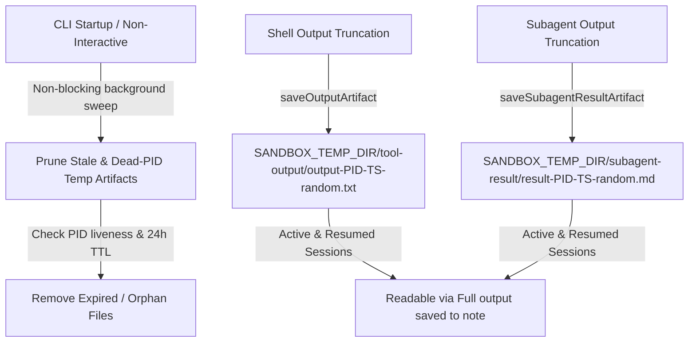

# Temporary Directory & Tool Output Lifecycle Cleanup

Status: **implemented and merged**

## Resume here

Audited all tools and runtime components writing to temporary directories (`os.tmpdir()`, `/tmp`, `SANDBOX_TEMP_DIR`).

Key design decisions based on review:
1. **Relocate Spool Roots First**: Move all tool output and subagent result artifacts under the deterministic per-user root `SANDBOX_TEMP_DIR` (`${SANDBOX_TEMP_DIR}/tool-output/` and `${SANDBOX_TEMP_DIR}/subagent-result/`), rather than creating arbitrary `mkdtemp` prefixes in `/tmp`.
2. **Age-Based Retention Instead of Exit Deletion**: Do not delete spooled files on process exit. Keeping spooled files across session exits preserves the ability for users and subsequent resuming turns to inspect output paths mentioned in conversation history (`Full output saved to \`<path>\``).
3. **Hardened Sweep with PID Liveness**: Startup performs a background sweep that inspects creating PIDs (via `process.kill(pid, 0)`) and file ages. Files created by dead PIDs (past a 5-minute grace window) or older than 24 hours TTL are reclaimed.
4. **Trimmed Lifecycle Hooks**: No intrusive `process.on('exit')` deletion hooks are added.

---

## Destination & Key Invariants

1. **Deterministic Rooting**: All application temporary outputs are consolidated within `SANDBOX_TEMP_DIR` (`tool-output/`, `subagent-result/`, `docker-config-*`, `xdg/`).
2. **Transcript Readback Stability**: Spooled tool output files remain valid and accessible across process restarts and turns until evicted by TTL / dead-PID sweep.
3. **Safe PID Liveness Sweep**: Sweeper uses `process.kill(pid, 0)` to safely identify dead processes without removing files belonging to concurrently active `term2` sessions.
4. **Zero Startup Latency**: Cleanup is initiated non-blockingly in the background during app startup.

---

## Architecture & Design



---

## Proposed Milestones

### Milestone 1 — Relocate Spool Roots under `SANDBOX_TEMP_DIR`

**Target files:**
- `source/utils/shell/shell-output.ts`:
  - Direct `saveOutputArtifact` to `${SANDBOX_TEMP_DIR}/tool-output/`.
  - Format filenames as `output-${process.pid}-${Date.now()}-${randomBytes(3).toString('hex')}.txt`.
- `source/services/subagents/execution-runner.ts`:
  - Direct `saveSubagentResultArtifact` to `${SANDBOX_TEMP_DIR}/subagent-result/`.
  - Format filenames as `result-${process.pid}-${Date.now()}-${randomBytes(3).toString('hex')}.md`.

### Milestone 2 — PID Liveness & Age-Based Temp Sweeper

**Target file:** `source/utils/shell/temp-sweep.ts` (and unit tests in `source/utils/shell/temp-sweep.test.ts`)

- Provide `pruneStaleTempArtifacts(options?: TempSweepOptions): Promise<void>`:
  - Check PID liveness with `isPidAlive(pid)` (handling `ESRCH` vs `EPERM`).
  - Prune files from dead PIDs older than grace window (5 min).
  - Prune any files/directories older than `maxAgeMs` (default 24h).
  - Sweep legacy `os.tmpdir()` entries (`term2-tool-output-*`, `term2-subagent-result-*`) to clean up past leaks.

### Milestone 3 — Startup Integration

**Target files:**
- `source/cli.tsx`:
  - Launch non-blocking background sweep on startup: `void pruneStaleTempArtifacts().catch(() => {});`
- `source/non-interactive.ts`:
  - Launch non-blocking background sweep on startup: `void pruneStaleTempArtifacts().catch(() => {});`

### Milestone 4 — Test Updates & Hardening

**Target files:**
- `source/tools/system/docker-host-control.integration.test.ts`:
  - Add explicit `control.cleanup()` in tests.
- `source/utils/shell/temp-sweep.test.ts`:
  - Test PID liveness detection and age eviction rules.
- `source/utils/shell/shell-output.test.ts` & `source/services/subagents/execution-runner.test.ts`:
  - Update expected artifact directories and file paths.

---

## Verification Plan

### Automated Tests
```bash
# 1. Run temp sweeper unit tests
NODE_ENV=test pnpm test source/utils/shell/temp-sweep.test.ts

# 2. Run shell output and subagent execution tests
NODE_ENV=test pnpm test source/utils/shell/shell-output.test.ts source/utils/output/bound-tool-result.test.ts source/services/subagents/execution-runner.test.ts

# 3. Run full test suite
NODE_ENV=test pnpm test

# 4. Run provider black-box suite (non-negotiable for non-interactive/run-loop touchpoints)
NODE_ENV=test pnpm test:provider-black-box
```

### Manual Verification
1. Run a command generating large output to confirm spooled output file is written to `${SANDBOX_TEMP_DIR}/tool-output/` with PID & timestamp metadata.
2. Confirm spooled output files remain readable after session exit.
3. Test that subsequent runs prune mock dead-PID files in the background without affecting live runs.
