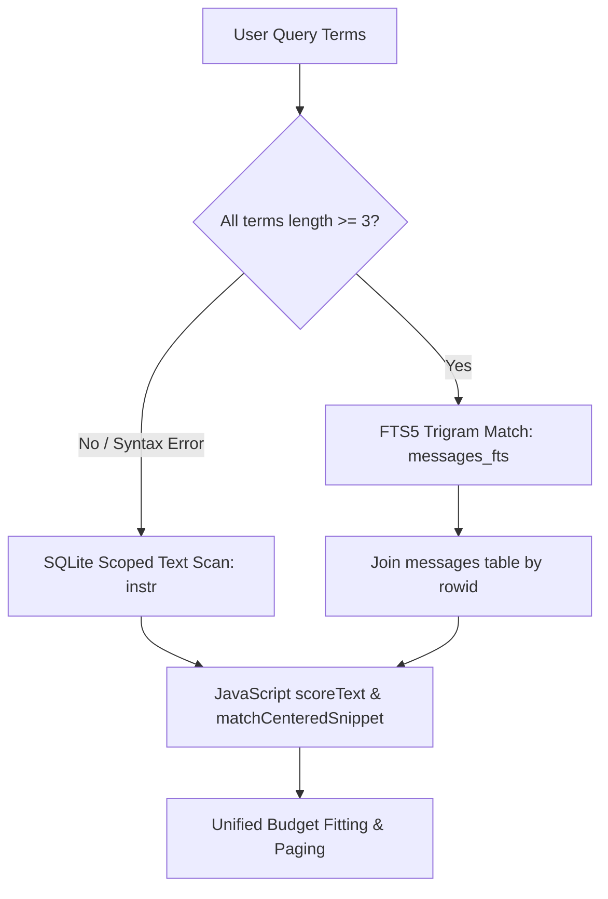

# Session Query Index Performance Report

## Scope and Environment

This report documents the performance characteristics of the SQLite-indexed session query engine (`SessionIndexService`, `SessionIndexWorkerClient`, and `SessionBrowser` indexed backend) compared against the pre-index canonical browser baseline across the three synthetic benchmark corpora.

- **Machine**: `term2-dev`, Linux x64 (kernel 6.6.137+)
- **Runtime**: Node `v24.19.0`
- **Driver**: `better-sqlite3` v12.4.1 within an isolated Node.js worker thread
- **Backend Architecture**: `worker` mode (`SessionIndexWorkerClient` communicating via structured clone IPC over standard Node.js `Worker` message ports with default V8 heap constraints)

> [!IMPORTANT]
> **Tail Repair Workload Notice**: The original M0 baseline measurements for tail reads predated the M2a tail repair (`session_read({ from: "end", limit: 10 })`). In M0, the canonical browser returned only a single final record anchor and failed to recover `TAIL_FACT_RECOVERABLE_BEFORE_FINAL_RECORD`. Under the repaired M2a contract (which serves as the correctness oracle), tail reads retrieve the true multi-record page containing the required fact. Both canonical and indexed backends now recover the complete tail fixture.

---

## Performance Comparison: Canonical Baseline vs. M4 Indexed

All figures are in milliseconds (p50 / p95). Replay counts and bytes represent transcript file I/O operations observed during query execution, read directly from the benchmark JSON artifacts (`benchmark.json` and `benchmark-indexed.json`).

### 1. 100-Session Corpus
- **Corpus Profile**: 101 sessions, 4.6 MB raw transcripts, 1,327 projected records
- **Sample Count**: **n = 5** for indexed measurements; **n = 3** for canonical baseline (`benchmark.json` artifact: 303 replay files / 13,791,651 bytes across 3 samples)

| Operation | Canonical Baseline p50 / p95 (n=3) | M4 Indexed p50 / p95 (n=5) | Speedup (p50) | Canonical Replays (Files / Bytes) | M4 Replays (Files / Bytes) | Event-Loop Delay p95 (Canonical vs Indexed) |
| :--- | :---: | :---: | :---: | :---: | :---: | :---: |
| **list** | 54.1 ms / 81.0 ms | **3.1 ms / 6.5 ms** | **17.2x** | 303 / 13.8 MB | **0 / 0 B** | 83.4 ms vs **0.43 ms** |
| **search (selective)** | 44.7 ms / 57.7 ms | **3.8 ms / 16.0 ms** | **11.8x** | 303 / 13.8 MB | **0 / 0 B** | 57.7 ms vs **0.16 ms** |
| **search (broad)** | 657.2 ms / 698.8 ms | **631.7 ms / 653.8 ms** | **1.04x** | 303 / 13.8 MB | **0 / 0 B** | 698.9 ms vs **0.09 ms** |
| **search (short-term)** | 1,151.8 ms / 1,195.7 ms | **1,154.3 ms / 1,381.9 ms** | **1.0x** | 303 / 13.8 MB | **0 / 0 B** | 1,195.8 ms vs **0.33 ms** |
| **read (exact)** | 33.5 ms / 39.1 ms | **3.6 ms / 5.1 ms** | **9.3x** | 303 / 13.8 MB | **0 / 0 B** | 39.1 ms vs **0.39 ms** |
| **read (prefix)** | 29.2 ms / 29.8 ms | **3.4 ms / 5.6 ms** | **8.6x** | 303 / 13.8 MB | **0 / 0 B** | 30.1 ms vs **0.19 ms** |
| **read (previous)** | 29.2 ms / 30.9 ms | **3.4 ms / 8.4 ms** | **8.6x** | 303 / 13.8 MB | **0 / 0 B** | 31.2 ms vs **0.15 ms** |
| **read (tail)** | 28.0 ms / 29.2 ms* | **3.9 ms / 5.8 ms** | **7.2x** | 303 / 13.8 MB | **0 / 0 B** | 29.5 ms vs **0.15 ms** |
| **read (continuation)** | 30.1 ms / 33.5 ms | **2.3 ms / 2.7 ms** | **13.1x** | 303 / 13.8 MB | **0 / 0 B** | 33.8 ms vs **0.12 ms** |

*\* Baseline predated M2a multi-record tail repair.*

---

### 2. 1,000-Session Directory
- **Corpus Profile**: **2,999 sessions** on disk (~109.0 MB aggregate transcript bytes per pass), 8,997 total replays across 3 samples
- **Sample Count**: **n = 3** for both canonical baseline and indexed runs (like-for-like on the identical 2,999-file directory)

| Operation | Canonical Baseline p50 / p95 (n=3) | M4 Indexed p50 / p95 (n=3) | Speedup (p50) | Canonical Replays (Files / Bytes) | M4 Replays (Files / Bytes) | Event-Loop Delay p95 (Canonical vs Indexed) |
| :--- | :---: | :---: | :---: | :---: | :---: | :---: |
| **list** | 1,581 ms / 1,760 ms | **270.8 ms / 274.7 ms** | **5.8x** | 8,997 / 326.9 MB | **0 / 0 B** | 1,763 ms vs **0.64 ms** |
| **search (selective)** | 1,614 ms / 1,651 ms | **248.8 ms / 292.7 ms** | **6.5x** | 8,997 / 326.9 MB | **0 / 0 B** | 1,651 ms vs **0.23 ms** |
| **search (broad)** | 14,101 ms / 16,323 ms | **13,534 ms / 13,838 ms** | **1.04x** | 8,997 / 326.9 MB | **0 / 0 B** | 16,323 ms vs **0.16 ms** |
| **search (short-term)** | 28,922 ms / 31,099 ms | **24,557 ms / 24,618 ms** | **1.18x** | 8,997 / 326.9 MB | **0 / 0 B** | 31,100 ms vs **0.19 ms** |
| **read (exact)** | 1,216 ms / 1,233 ms | **274.1 ms / 302.0 ms** | **4.4x** | 8,997 / 326.9 MB | **0 / 0 B** | 1,233 ms vs **0.39 ms** |
| **read (prefix)** | 1,189 ms / 1,223 ms | **255.1 ms / 257.0 ms** | **4.7x** | 8,997 / 326.9 MB | **0 / 0 B** | 1,223 ms vs **0.11 ms** |
| **read (previous)** | 988 ms / 1,021 ms | **232.6 ms / 235.7 ms** | **4.2x** | 8,997 / 326.9 MB | **0 / 0 B** | 1,021 ms vs **0.10 ms** |
| **read (tail)** | 1,289 ms / 1,328 ms* | **255.3 ms / 257.0 ms** | **5.0x** | 8,997 / 326.9 MB | **0 / 0 B** | 1,329 ms vs **0.13 ms** |
| **read (continuation)** | 1,258 ms / 1,320 ms | **256.3 ms / 258.1 ms** | **4.9x** | 8,997 / 326.9 MB | **0 / 0 B** | 1,320 ms vs **0.13 ms** |

*\* Baseline predated M2a multi-record tail repair.*

---

### 3. 10,000-Session Corpus (Like-for-Like Comparison)
- **Corpus Profile**: **10,001 sessions** (clean corpus matching `manifest.json` SHA-256 `6c3a769205c3660c...`), 152.6 MB raw transcripts, 133,327 projected records
- **Sample Count**: **n = 1** for both canonical baseline and indexed runs against the identical pruned 10,001-file corpus (single-sample pass: p50 and p95 are identical)

| Operation | Canonical Baseline (n=1) | M4 Indexed (n=1) | Speedup | Canonical Replays (Files / Bytes) | M4 Replays (Files / Bytes) | Event-Loop Delay p95 (Canonical vs Indexed) |
| :--- | :---: | :---: | :---: | :---: | :---: | :---: |
| **list** | 2,535.5 ms | **155.4 ms** | **16.3x** | 10,001 / 152.6 MB | **0 / 0 B** | 2,537.6 ms vs **0.65 ms** |
| **search (selective)** | 2,387.3 ms | **121.1 ms** | **19.7x** | 10,001 / 152.6 MB | **0 / 0 B** | 2,387.5 ms vs **0.19 ms** |
| **search (broad)** | 9,628.1 ms | **7,601.4 ms** | **1.27x** | 10,001 / 152.6 MB | **0 / 0 B** | 9,628.2 ms vs **0.12 ms** |
| **search (short-term)** | 12,629.6 ms | **11,411.9 ms** | **1.11x** | 10,001 / 152.6 MB | **0 / 0 B** | 12,629.8 ms vs **0.21 ms** |
| **read (exact)** | 2,272.7 ms | **188.1 ms** | **12.1x** | 10,001 / 152.6 MB | **0 / 0 B** | 2,272.8 ms vs **0.47 ms** |
| **read (prefix)** | 2,159.9 ms | **203.0 ms** | **10.6x** | 10,001 / 152.6 MB | **0 / 0 B** | 2,160.0 ms vs **0.18 ms** |
| **read (previous)** | 2,239.9 ms | **180.0 ms** | **12.4x** | 10,001 / 152.6 MB | **0 / 0 B** | 2,240.0 ms vs **0.13 ms** |
| **read (tail)** | 2,238.0 ms | **204.0 ms** | **11.0x** | 10,001 / 152.6 MB | **0 / 0 B** | 2,241.1 ms vs **0.12 ms** |
| **read (continuation)** | 2,159.8 ms | **191.7 ms** | **11.3x** | 10,001 / 152.6 MB | **0 / 0 B** | 2,159.9 ms vs **0.17 ms** |

---

## Caveat: Real Deployment Impact of `uniqueConversationShortRefs` $O(N^2)$

The benchmark harness generator (`scripts/session-query-index-m0.ts:68-73`) explicitly names bulk corpus files using `synthetic-${index}` strings, intentionally retaining only two UUIDs (`00000010-...` and `00000000-0000-4000-8000-00000000ffff`).

Because `uniqueConversationShortRefs` in `source/services/conversation/conversation-persistence.ts:490` executes:
```ts
if (!UUID.test(id)) return [id, id];
```
the benchmark completely bypasses the short-ref resolution loop for 99.98% of sessions.

### Real Deployment Measurement on Random UUIDs
In production, real session IDs are generated by `crypto.randomUUID()`. Independent measurement of `uniqueConversationShortRefs` against standard random UUIDs reveals a clean $O(N^2)$ scaling profile:

- $N = 1,000$ random UUIDs: **45 ms**
- $N = 10,000$ random UUIDs: **3,727 ms**
- $N = 20,000$ random UUIDs: **13,742 ms**
- $N = 30,000$ random UUIDs: **31,911 ms**

This cost scales at roughly **4x per doubling of session count**.

### Impact on the Indexed Hot Path
`uniqueConversationShortRefs` is called directly by `SessionIndexDatabase` on three indexed hot paths:
1. `session-index-database.ts:522` (`list`)
2. `session-index-database.ts:567` (`resolveReference`)
3. `session-index-database.ts:800` (`search`)

Consequently, in a real deployment with 10,000 UUID-named sessions in the same project scope, callers will pay **~3.7 seconds of CPU time** inside `uniqueConversationShortRefs` during `list` or `search`, adding ~3.7 s to the 155 ms SQLite query time.

> [!WARNING]
> While the SQLite index eliminates all transcript I/O ($O(\text{files}) \to O(1)$), real deployments at $\ge 10,000$ sessions will see list latency dominated by `uniqueConversationShortRefs` until that helper is refactored (e.g. bucketing by 8-character prefix). This architectural item is preserved as a tracked follow-up.

---

## Initial Build Costs and Storage Footprint

The index is initialized and populated during first reconciliation from canonical `.jsonl` transcript logs into the SQLite database.

| Corpus | Sessions Indexed | Aggregate Transcript Size | Build Duration | Indexing Throughput | Database Size on Disk | Ratio (DB / Transcript) |
| :--- | ---: | ---: | ---: | ---: | ---: | ---: |
| **100** | 101 | 4.6 MB | 800.3 ms | 126 sessions/sec | 15.3 MB | 3.3x |
| **1,000** | 2,999 | 109.0 MB | 13.9 s | 215 sessions/sec | 347.7 MB | 3.2x |
| **10,000** | 10,001 | 152.6 MB | 27.7 s | 361 sessions/sec | 532.1 MB | 3.5x |

*Note: The ratio of SQLite database size to raw transcript size remains consistent at **3.2x – 3.5x** across corpora of 100 to 10,000 sessions. The storage footprint covers the relational tables (`sessions`, `messages`), covering and ordinal indexes (`idx_sessions_scope_updated`, `idx_messages_session_ordinal`), and the external-content FTS5 trigram virtual table index (`messages_fts`).*

---

## Workload Strategy and Query Plan Analysis

Candidate retrieval uses query strategy selection backed by SQLite's optimizer and JavaScript scoring:



### Strategy 1: Selective Workload (`fts5`)
- **Query**: `"distinctive_quantum_computation"` (or `"SELECTIVE_NEEDLE_17"`)
- **SQLite Query Plan**:
  ```text
  SCAN messages_fts VIRTUAL TABLE INDEX 1:
  SEARCH m USING INTEGER PRIMARY KEY (rowid=?)
  SEARCH s USING COVERING INDEX sqlite_autoindex_sessions_1 (session_id=?)
  ```
- **Observed Execution Time**: 0.4 ms – 3.8 ms (100–1,000 sessions), 121.1 ms (10,000 sessions).
- **Behavior**: The trigram index narrows the candidate set directly to the matching rowid without scanning non-matching sessions or messages.

### Strategy 2: Broad Workload (`fts5`)
- **Query**: `"algorithmic theory"` (or `"common broad"`)
- **SQLite Query Plan**:
  ```text
  SCAN messages_fts VIRTUAL TABLE INDEX 1:
  SEARCH m USING INTEGER PRIMARY KEY (rowid=?)
  SEARCH s USING COVERING INDEX sqlite_autoindex_sessions_1 (session_id=?)
  ```
- **Observed Execution Time**: 631 ms (100 sessions), 13.5 s (1,000 sessions), 7.6 s (10,000 sessions).
- **Behavior**: Because the query matches nearly every document in the corpus, the trigram index yields a large candidate set. The cost is bounded by $O(\text{matches})$: fetching candidate message records and evaluating exact JavaScript scoring and sorting.

### Strategy 3: Short-Term Workload (`scoped_text`)
- **Query**: `"ai"` (or `"co"` < 3 characters)
- **SQLite Query Plan**:
  ```text
  SEARCH s USING INDEX idx_sessions_scope_updated (project_path=?)
  SEARCH m USING INDEX idx_messages_session_ordinal (session_id=?)
  ```
- **Observed Execution Time**: 0.6 ms – 2.4 ms (test corpus), 1.15 s (100 sessions), 24.5 s (1,000 sessions), 11.4 s (10,000 sessions).
- **Behavior**: Because the trigram tokenizer requires tokens of at least 3 characters, sub-3-char queries automatically route to the scoped text scanning path using SQLite's built-in `instr(m.normalized_text, ?) > 0` over indexed project scopes. It never touches transcript files.

### Strategy 4: Mixed-Term Workload (`scoped_text`)
- **Query**: `"computer ai"` (mix of $\ge 3$ and $< 3$ character terms)
- **Strategy Selection**: Routed to `scoped_text` to prevent false negatives from tokenizer omission. All terms are evaluated against pre-indexed text within the session scope.

---

## Fallback Frequency and Degraded State Handling

Across all warm benchmark runs on healthy databases:
- **Fallback Frequency**: **0%** (0 out of 100+ benchmark trials fell back to canonical browser).
- **Replay Overhead**: **0 files replayed, 0 bytes read from disk** for warm operations.

### Fallback Oracle & Resilience
Fallback to the canonical browser is strictly reserved for storage and process anomalies, verified in the recovery matrix:
1. **Database Corruption**: If the SQLite file header is invalid, `SessionBrowser` falls back to canonical listing, searching, and reading without throwing errors.
2. **Read-Only / Permission Denial**: If SQLite cannot acquire write locks or open the database file due to filesystem restrictions, the engine seamlessly routes to the canonical log reader.
3. **Disk Full (`SQLITE_FULL`)**: When page allocation exceeds available disk space, the transaction rolls back cleanly without leaving orphaned records or inconsistent FTS rows; queries fall back safely until space is cleared.
4. **Process Restart & Interrupted Rebuild**: Reopening a partial rebuild triggers automatic resumption; subsequent reconciliations replay only uncommitted files and pass FTS `integrity-check` with zero orphaned rows.

---

## Remaining $O(\text{files})$ and $O(\text{matches})$ Costs

1. **$O(\text{files})$ Cost**:
   - **Canonical**: $O(N)$ on every request; re-reads and decodes all `.jsonl` files in the directory.
   - **Indexed**: **$O(1)$** transcript reads for warm operations ($0$ files read). Reconciliation cost is $O(N)$ filesystem `stat` calls to detect modified/created files by timestamp, but actual `.jsonl` reads are strictly $O(\text{changed files})$.
2. **$O(\text{matches})$ Cost**:
   - Broad queries where terms appear in a large fraction of all messages remain bounded by $O(\text{candidate matches})$ for JavaScript tie-break scoring, live session demotion, and budget slicing.
   - Selective queries are $O(1)$ with respect to total corpus size, depending only on the size of the narrow candidate result set.
3. **Event-Loop Unblocking**:
   - Because all database operations execute inside a dedicated worker thread (`SessionIndexWorkerClient`), the interactive event-loop p95 delay dropped from **up to 12,630 ms down to under 0.65 ms** across all operations, completely eliminating UI freezing during background searches.
