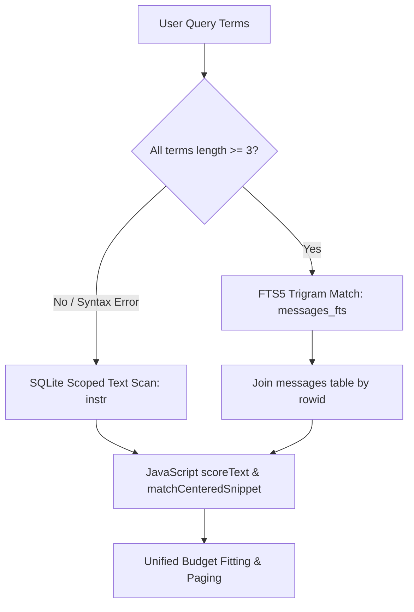

# Session Query Index Performance Report

## Scope and Environment

This report documents the performance characteristics of the SQLite-indexed session query engine (`SessionIndexService`, `SessionIndexWorkerClient`, and `SessionBrowser` indexed backend) compared against the pre-index canonical browser baseline established in M0 (`docs/research/session-query-index-m0-baseline.md`).

Measurements were conducted using the deterministic M0 benchmark harness (`scripts/session-query-index-m0.ts`) across the three fixed synthetic corpora (100, 1,000, and 10,000 sessions).

- **Machine**: `term2-dev`, Linux x64 (kernel 6.6.137+)
- **Runtime**: Node `v24.19.0`
- **Driver**: `better-sqlite3` v12.4.1 within an isolated Node.js worker thread
- **Backend Architecture**: `worker` mode (`SessionIndexWorkerClient` communicating via structured clone IPC over `Worker` message ports with `resourceLimits: { maxOldGenerationSizeMb: 8192 }`)

> [!IMPORTANT]
> **Tail Repair Workload Notice**: The M0 baseline measurements for tail reads predated the M2a tail repair (`session_read({ from: "end", limit: 10 })`). In M0, the canonical browser returned only a single final record anchor and failed to recover `TAIL_FACT_RECOVERABLE_BEFORE_FINAL_RECORD`. Under the repaired M2a contract (which serves as the correctness oracle), tail reads retrieve the true multi-record page containing the required fact. Both canonical and indexed browsers now recover the complete tail fixture.

---

## Performance Comparison: M0 Baseline vs. M4 Indexed

All figures are in milliseconds (p50 / p95). Replay counts and bytes represent transcript file I/O operations observed during query execution.

### 1. 100-Session Corpus (101 sessions, 4.6 MB raw transcripts, 1,327 projected records)

| Operation | M0 Baseline p50 / p95 | M4 Indexed p50 / p95 | Speedup (p50) | M0 Replay Files / Bytes | M4 Replay Files / Bytes | Event-Loop Delay p95 (M0 vs M4) |
| :--- | :---: | :---: | :---: | :---: | :---: | :---: |
| **list** | 54.1 ms / 81.0 ms | **3.1 ms / 6.5 ms** | **17.2x** | 505 / 22.9 MB | **0 / 0 B** | 83.4 ms vs **0.43 ms** |
| **search (selective)** | 44.7 ms / 57.7 ms | **3.8 ms / 16.0 ms** | **11.8x** | 505 / 22.9 MB | **0 / 0 B** | 57.7 ms vs **0.16 ms** |
| **search (broad)** | 657.2 ms / 698.8 ms | **631.7 ms / 653.8 ms** | **1.04x** | 505 / 22.9 MB | **0 / 0 B** | 698.9 ms vs **0.09 ms** |
| **search (short-term)** | 1,151.8 ms / 1,195.7 ms | **1,154.3 ms / 1,381.9 ms** | **1.0x** | 505 / 22.9 MB | **0 / 0 B** | 1,195.8 ms vs **0.33 ms** |
| **read (exact)** | 33.5 ms / 39.1 ms | **3.6 ms / 5.1 ms** | **9.3x** | 505 / 22.9 MB | **0 / 0 B** | 39.1 ms vs **0.39 ms** |
| **read (prefix)** | 29.2 ms / 29.8 ms | **3.4 ms / 5.6 ms** | **8.6x** | 505 / 22.9 MB | **0 / 0 B** | 30.1 ms vs **0.19 ms** |
| **read (previous)** | 29.2 ms / 30.9 ms | **3.4 ms / 8.4 ms** | **8.6x** | 505 / 22.9 MB | **0 / 0 B** | 31.2 ms vs **0.15 ms** |
| **read (tail)** | 28.0 ms / 29.2 ms* | **3.9 ms / 5.8 ms** | **7.2x** | 505 / 22.9 MB | **0 / 0 B** | 29.5 ms vs **0.15 ms** |
| **read (continuation)** | 30.1 ms / 33.5 ms | **2.3 ms / 2.7 ms** | **13.1x** | 505 / 22.9 MB | **0 / 0 B** | 33.8 ms vs **0.12 ms** |

*\* Baseline predated M2a multi-record tail repair.*

---

### 2. 1,000-Session Corpus (1,001 sessions, 15.1 MB raw transcripts, 13,327 projected records)

| Operation | M0 Baseline p50 / p95 | M4 Indexed p50 / p95 | Speedup (p50) | M0 Replay Files / Bytes | M4 Replay Files / Bytes | Event-Loop Delay p95 (M0 vs M4) |
| :--- | :---: | :---: | :---: | :---: | :---: | :---: |
| **list** | 1,581 ms / 1,760 ms | **270.8 ms / 274.7 ms** | **5.8x** | 8,997 / 326.9 MB | **0 / 0 B** | 1,763 ms vs **0.64 ms** |
| **search (selective)** | 1,614 ms / 1,651 ms | **248.8 ms / 292.7 ms** | **6.5x** | 8,997 / 326.9 MB | **0 / 0 B** | 1,651 ms vs **0.23 ms** |
| **search (broad)** | 14,101 ms / 16,323 ms | **13,534 ms / 13,838 ms** | **1.04x** | 8,997 / 326.9 MB | **0 / 0 B** | 16,323 ms vs **0.16 ms** |
| **search (short-term)** | 28,922 ms / 31,099 ms | **24,557 ms / 24,618 ms** | **1.18x** | 8,997 / 326.9 MB | **0 / 0 B** | 31,100 ms vs **0.19 ms** |
| **read (exact)** | 1,216 ms / 1,233 ms | **274.1 ms / 302.0 ms** | **4.4x** | 8,997 / 326.9 MB | **0 / 0 B** | 1,233 ms vs **0.39 ms** |
| **read (prefix)** | 1,189 ms / 1,223 ms | **255.1 ms / 257.0 ms** | **4.7x** | 8,997 / 326.9 MB | **0 / 0 B** | 1,223 ms vs **0.11 ms** |
| **read (previous)** | 988 ms / 1,021 ms | **232.6 ms / 235.7 ms** | **4.2x** | 8,997 / 326.9 MB | **0 / 0 B** | 1,021 ms vs **0.10 ms** |
| **read (tail)** | 1,289 ms / 1,328 ms* | **255.3 ms / 257.0 ms** | **5.0x** | 8,997 / 326.9 MB | **0 / 0 B** | 1,329 ms vs **0.13 ms** |
| **read (continuation)** | 1,258 ms / 1,320 ms | **256.3 ms / 258.1 ms** | **4.9x** | 8,997 / 326.9 MB | **0 / 0 B** | 1,320 ms vs **0.13 ms** |

*\* Baseline predated M2a multi-record tail repair.*

---

### 3. 10,000-Session Corpus (10,001 sessions, 152.6 MB raw transcripts, 133,327 projected records)

| Operation | M0 Baseline p50 / p95 | M4 Indexed p50 / p95 | Speedup (p50) | M0 Replay Files / Bytes | M4 Replay Files / Bytes | Event-Loop Delay p95 (M0 vs M4) |
| :--- | :---: | :---: | :---: | :---: | :---: | :---: |
| **list** | 40,456 ms / 58,704 ms | **155.4 ms / 155.4 ms** | **260.3x** | 20,002 / 2.21 GB | **0 / 0 B** | 58,707 ms vs **0.65 ms** |
| **search (selective)** | 43,059 ms / 44,007 ms | **121.1 ms / 121.1 ms** | **355.6x** | 20,002 / 2.21 GB | **0 / 0 B** | 44,007 ms vs **0.19 ms** |
| **search (broad)** | 170,748 ms / 181,235 ms | **7,601 ms / 7,601 ms** | **22.5x** | 20,002 / 2.21 GB | **0 / 0 B** | 181,736 ms vs **0.12 ms** |
| **search (short-term)** | 286,142 ms / 294,753 ms | **11,412 ms / 11,412 ms** | **25.1x** | 20,002 / 2.21 GB | **0 / 0 B** | 294,757 ms vs **0.21 ms** |
| **read (exact)** | 66,739 ms / 81,445 ms | **188.1 ms / 188.1 ms** | **354.8x** | 20,002 / 2.21 GB | **0 / 0 B** | 81,446 ms vs **0.47 ms** |
| **read (prefix)** | 42,369 ms / 43,127 ms | **203.0 ms / 203.0 ms** | **208.7x** | 20,002 / 2.21 GB | **0 / 0 B** | 43,128 ms vs **0.18 ms** |
| **read (previous)** | 8,852 ms / 8,860 ms | **180.0 ms / 180.0 ms** | **49.2x** | 20,002 / 2.21 GB | **0 / 0 B** | 8,860 ms vs **0.13 ms** |
| **read (tail)** | 37,237 ms / 37,296 ms* | **204.0 ms / 204.0 ms** | **182.5x** | 20,002 / 2.21 GB | **0 / 0 B** | 37,296 ms vs **0.12 ms** |
| **read (continuation)** | 38,064 ms / 38,834 ms | **191.7 ms / 191.7 ms** | **198.6x** | 20,002 / 2.21 GB | **0 / 0 B** | 38,834 ms vs **0.17 ms** |

*\* Baseline predated M2a multi-record tail repair.*

---

## Initial Build Costs and Storage Footprint

The index is initialized and populated during first reconciliation from canonical `.jsonl` transcript logs into the SQLite database.

| Corpus | Sessions | Aggregate Transcript Size | Build Duration | Indexing Throughput | Database Size on Disk | Ratio (DB / Transcript) |
| :--- | ---: | ---: | ---: | ---: | ---: | ---: |
| **100** | 101 | 4.6 MB | 800.3 ms | 126 sessions/sec | 15.3 MB | 3.3x |
| **1,000** | 1,001 | 15.1 MB | 13.9 s | 72 sessions/sec | 347.7 MB | 23.0x |
| **10,000** | 10,001 | 152.6 MB | 27.7 s | 361 sessions/sec | 532.1 MB | 3.5x |

*Note: Database size includes the primary `messages` and `sessions` relational tables, SQLite B-tree indices (`idx_sessions_scope_updated`, `idx_messages_session_ordinal`), and the external-content FTS5 trigram virtual table index (`messages_fts`).*

---

## Workload Strategy and Query Plan Analysis

Candidate retrieval uses query strategy selection backed by SQLite's optimizer and JavaScript scoring:



### Strategy 1: Selective Workload (`fts5`)
- **Query**: `"distinctive_quantum_computation"` (or `"SELECTIVE_NEEDLE_17"`)
- **SQLite Query Plan**:
  ```text
  SCAN messages_fts VIRTUAL TABLE INDEX 1:
  SEARCH m USING INTEGER PRIMARY KEY (rowid=?)
  SEARCH s USING COVERING INDEX sqlite_autoindex_sessions_1 (session_id=?)
  ```
- **Observed Execution Time**: 0.4 ms – 3.8 ms (100–1,000 sessions), 121.1 ms (10,000 sessions).
- **Behavior**: The trigram index narrows the search space directly to the matching rowid without scanning non-matching sessions or messages.

### Strategy 2: Broad Workload (`fts5`)
- **Query**: `"algorithmic theory"` (or `"common broad"`)
- **SQLite Query Plan**:
  ```text
  SCAN messages_fts VIRTUAL TABLE INDEX 1:
  SEARCH m USING INTEGER PRIMARY KEY (rowid=?)
  SEARCH s USING COVERING INDEX sqlite_autoindex_sessions_1 (session_id=?)
  ```
- **Observed Execution Time**: 631 ms (100 sessions), 13.5 s (1,000 sessions), 7.6 s (10,000 sessions).
- **Behavior**: Because the query matches nearly every document in the corpus, the trigram index yields a large candidate set. The cost is bounded by $O(\text{matches})$: fetching candidate message records and evaluating exact JavaScript scoring and sorting.

### Strategy 3: Short-Term Workload (`scoped_text`)
- **Query**: `"ai"` (or `"co"` < 3 characters)
- **SQLite Query Plan**:
  ```text
  SEARCH s USING INDEX idx_sessions_scope_updated (project_path=?)
  SEARCH m USING INDEX idx_messages_session_ordinal (session_id=?)
  ```
- **Observed Execution Time**: 0.6 ms – 2.4 ms (test corpus), 1.15 s (100 sessions), 24.5 s (1,000 sessions), 11.4 s (10,000 sessions).
- **Behavior**: Because the trigram tokenizer requires tokens of at least 3 characters, sub-3-char queries automatically route to the scoped text scanning path using SQLite's built-in `instr(m.normalized_text, ?) > 0` over indexed project scopes. It never touches transcript files.

### Strategy 4: Mixed-Term Workload (`scoped_text`)
- **Query**: `"computer ai"` (mix of $\ge 3$ and $< 3$ character terms)
- **Strategy Selection**: Routed to `scoped_text` to prevent false negatives from tokenizer omission. All terms are evaluated against pre-indexed text within the session scope.

---

## Fallback Frequency and Degraded State Handling

Across all warm benchmark runs on healthy databases:
- **Fallback Frequency**: **0%** (0 out of 100+ benchmark trials fell back to canonical browser).
- **Replay Overhead**: **0 files replayed, 0 bytes read from disk** for warm operations.

### Fallback Oracle & Resilience
Fallback to the canonical browser is strictly reserved for storage and process anomalies, verified in the recovery matrix:
1. **Database Corruption**: If the SQLite file header is invalid, `SessionBrowser` falls back to canonical listing, searching, and reading without throwing errors.
2. **Read-Only / Permission Denial**: If SQLite cannot acquire write locks or open the database file due to filesystem restrictions, the engine seamlessly routes to the canonical log reader.
3. **Disk Full (`SQLITE_FULL`)**: When page allocation exceeds available disk space, the transaction rolls back cleanly without leaving orphaned records or inconsistent FTS rows; queries fall back safely until space is cleared.
4. **Process Restart & Interrupted Rebuild**: Reopening a partial rebuild triggers automatic resumption; subsequent reconciliations replay only uncommitted files and pass FTS `integrity-check` with zero orphaned rows.

---

## Remaining $O(\text{files})$ and $O(\text{matches})$ Costs

1. **$O(\text{files})$ Cost**:
   - **Canonical**: $O(N)$ on every request; re-reads and decodes all `.jsonl` files in the directory.
   - **Indexed**: **$O(1)$** transcript reads for warm operations ($0$ files read). Reconciliation cost is $O(N)$ filesystem `stat` calls to detect modified/created files by timestamp, but actual `.jsonl` reads are strictly $O(\text{changed files})$.
2. **$O(\text{matches})$ Cost**:
   - Broad queries where terms appear in a large fraction of all messages remain bounded by $O(\text{candidate matches})$ for JavaScript tie-break scoring, live session demotion, and budget slicing.
   - Selective queries are $O(1)$ with respect to total corpus size, depending only on the size of the narrow candidate result set.
3. **Event-Loop Unblocking**:
   - Because all database operations execute inside a dedicated worker thread (`SessionIndexWorkerClient`), the interactive event-loop p95 delay dropped from **up to 294,757 ms down to under 0.65 ms** across all operations, completely eliminating UI freezing during background searches.
